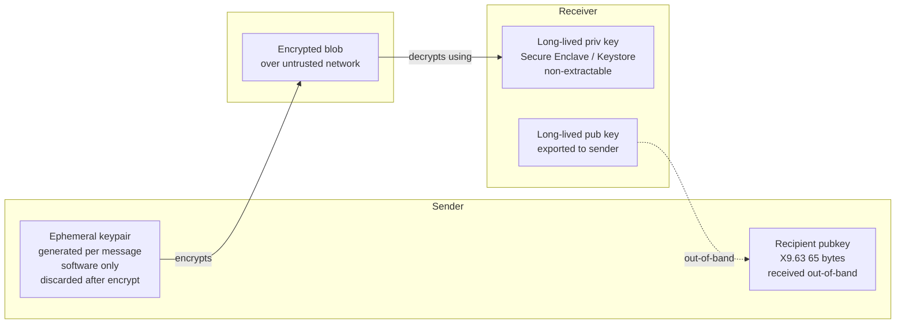
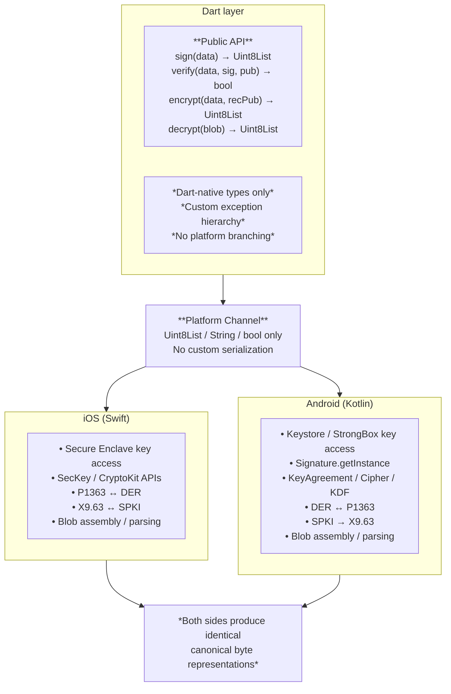
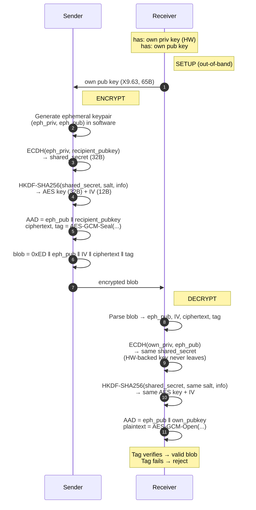

**TL;DR**

If you're building a Flutter app that needs hardware-backed cryptography on both iOS and Android — keys that survive a compromised process, signatures and encrypted blobs that survive the round trip between platforms — no package covers this end to end. This guide shows what to build instead: a platform-channel architecture with a clean Dart API, format reconciliation pushed to native, and a five-layer test pyramid that fails at the right layer.

**Stack:** ECDSA P-256 with SHA-256; hybrid encryption (ECDH P-256 + HKDF-SHA256 + AES-256-GCM); hardware-backed keys via Secure Enclave (iOS) and Keystore (Android).

**Length:** ~15 min read.

**Read this if** you're a Flutter or mobile engineer hitting cross-platform crypto pitfalls, or evaluating whether existing Flutter crypto packages solve your problem.

**Skip if** you only need software-keyed crypto (`cryptography`), data-at-rest storage (`flutter_secure_storage`), or sign-only flows (`biometric_signature`).

## Section 1: The Problem

### The mismatch mobile teams face

You're a Flutter team shipping to iOS and Android from one Dart codebase. A requirement lands: the app needs real cryptography — sign data the backend can verify, decrypt blobs the backend sends, hold a key pair an attacker can't extract even from a compromised device. The two platforms also need to interoperate. A signature from iPhone has to verify on Pixel. A blob encrypted to an Android public key has to decrypt on iOS. Whether it's one user across multiple devices or one backend talking to a fleet of clients, the underlying need is the same.

This is where the Flutter ecosystem stops helping you.

The platforms themselves are ready. iOS exposes Secure Enclave through `SecKey` and CryptoKit. Android exposes Keystore (StrongBox or TEE on modern devices) through `KeyStore` and `Cipher`. Both vendors document this thoroughly and have for years.

Capability isn't the issue. The issue is that the two platforms made different choices at every layer below the API, and nobody in the Flutter ecosystem has packaged a complete cross-platform reconciliation across all four operations.

Take signature format. Android's `java.security.Signature` emits ASN.1 DER. Apple's Security framework with `.ecdsaSignatureMessageX962SHA256` also returns DER. But CryptoKit's `P256.Signing.ECDSASignature` exposes both `rawRepresentation` (P1363, `r || s`) and `derRepresentation` as first-class properties, and most Swift sample code reaches for `rawRepresentation`. Pass that to an Android verifier and it fails silently with no helpful error. (We'll come back to this — the demo in this article deliberately uses `rawRepresentation` to make the conversion explicit.)

iOS exposes ECIES as one primitive (e.g., `eciesEncryptionStandardVariableIVX963SHA256AESGCM`) that bundles ephemeral key generation, X9.63 KDF, and AES-GCM into a single `SecKey` API call. Android exposes none of that — you compose it yourself from `KeyAgreement`, an HKDF (or X9.63 KDF) implementation, and `Cipher`.

Public key encoding diverges similarly. iOS's `SecKeyCopyExternalRepresentation` returns the X9.63 uncompressed point (65 bytes: `0x04 || X || Y`). Android's `getEncoded()` returns X.509 SubjectPublicKeyInfo, which wraps the same point in DER with an algorithm identifier. Same key material, different envelopes.

None of this is documented as "the cross-platform pitfall list" anywhere — you discover it the way the rest of us did, by shipping a sign-on-iOS verify-on-Android flow that returns false with no error, then spending two days bisecting the failure to a format the verifier didn't recognise.

So you look for a Flutter package. There are candidates. None solve the actual problem.

### Why existing packages don't fit

| Package | Sign/Verify | Encrypt/Decrypt | Hardware-backed asymmetric | Cross-platform interop |
| --- | --- | --- | --- | --- |
| `flutter_secure_storage` | — | — | — (storage, not crypto) | — |
| `cryptography` | ✓ | ✓ | ✗ (software only) | N/A |
| `biometric_signature` | ✓ | partial* | ✓ | ✗ |
| `flutter_secp256r1` | ✓ | ✗ (DIY) | ✓ | ✗ |

> \* hybrid decryption mode (ECIES with software EC + hardware AES wrap), not pure hardware-backed ECIES

No row checks all four columns. The prose below is the *why*.

**`flutter_secure_storage`** solves a different problem. It stores secrets in Keychain and EncryptedSharedPreferences — useful for data at rest, but you read the secret into Dart memory to use it. The key never participates in an operation the OS keeps inside secure hardware. It's also why "use `flutter_secure_storage`" is the most common wrong answer to "how do I do crypto in Flutter."

**`cryptography`** (Gohilla) is the most complete crypto library on pub.dev — ECDSA, ECDH, HKDF, AES-GCM, ChaCha20, all in pure Dart with optional native acceleration. If your threat model accepts software-held keys, it's a fine choice. But the keys live in software. Even with `cryptography_flutter` delegating to platform APIs where it can, the private key material isn't held inside Secure Enclave or StrongBox — that's a hardware property a software library can't synthesize. Cossack Labs made the point in their Flutter security writeup: no Flutter library drives Secure Enclave directly.

**`biometric_signature`** is the closest competitor. It generates a hardware-backed asymmetric key pair on both platforms and exposes `sign()` gated by biometrics. The key is non-extractable, the signature is real. For sign-only use cases like device identity or login challenges, it's a good package. It also offers a hybrid decryption mode, but the underlying EC private key is software, AES-wrapped by a hardware key — a useful tradeoff for some threat models, not pure hardware-backed ECIES. The package also doesn't address signature format differences across platforms, so signatures don't verify across iOS and Android without reconciliation it doesn't provide. One quadrant covered, not four.

**`flutter_secp256r1`** is the lowest-level option: P-256 primitives backed by Secure Enclave and Keystore for **key generation and signing**. Hardware-backed, real operations. But 'primitives' is the operative word. You get a signature, not a format guarantee. **Encryption isn't even in the API surface — to do ECIES you'd need to extend the package or fork it.** Cross-platform sign/verify still means handling P1363↔DER yourself.

What's missing is a single package covering all four operations (sign, verify, encrypt, decrypt) on hardware-backed asymmetric keys that never leave secure hardware, producing iOS and Android artifacts that can verify and decrypt each other. No package fills it. Either you compose `flutter_secp256r1` with your own ECIES implementation and your own format reconciliation, or you go down to platform channels with Swift and Kotlin directly.

This article is the second path.

---

## Section 2: The Crypto Stack

> **Aside: Why this construction (and not RSA-OAEP, HPKE, or NaCl)**
>
> RSA-OAEP: Secure Enclave only exposes secp256r1 EC keys to developers — RSA can't be stored in SE through the public API. Off the table for iOS hardware-backed.
>
> HPKE (RFC 9180): iOS 17+ ships HPKE in CryptoKit (stable since 2023). On Android, the user-facing `android.crypto.hpke.Hpke` class first appears in API 37 (Android 17), with stable release in mid-2026. (The underlying SPI shipped earlier in API 35, but that's for crypto providers to implement, not for app developers to call.) But neither high-level API accepts a Secure Enclave / Keystore-backed private key. To use HPKE with hardware-backed keys you'd drop down to ECDH primitives anyway — at which point you've reimplemented something close to what's below. Add to that the API 37 floor on the Android side — most Android devices won't see this for years — and HPKE doesn't change today's calculus. (For server-to-server crypto without hardware-key constraints, HPKE is the better answer.)
>
> NaCl / libsodium (X25519 + XSalsa20): SE doesn't hold Curve25519 keys.
>
> ECDH P-256 + HKDF + AES-GCM is what both platforms actually expose at the hardware-backed layer. Not the most elegant construction — the constrained one.

### What we're building



P-256 (secp256r1, prime256v1) for everything. Not because it's the best curve, but because it's the only NIST curve Secure Enclave holds. Android Keystore supports more (P-224 through P-521), but the cross-platform intersection is P-256. If you need SE on iOS, the choice is made for you.

The construction is built from primitives both platforms expose without third-party libraries:

- ECDSA P-256 with SHA-256 for sign/verify
- ECDH P-256 between local SE/Keystore key and an ephemeral peer key, then HKDF-SHA256 to derive a symmetric key, then AES-256-GCM for encrypt/decrypt

A note on the encrypt/decrypt construction: this is **not** Apple's built-in ECIES (`SecKeyCreateEncryptedData` with `eciesEncryptionStandardVariableIVX963SHA256AESGCM`). Apple's variant uses X9.63 KDF + AES-128-GCM — there's no AES-256 variant in the algorithm enumeration. Whether AES-256 matters for your threat model is a separate question — but if you decide it does, you can't use Apple's ECIES at all, you have to compose the construction yourself. Once you're composing on iOS, you might as well compose the same way on Android and get bit-for-bit parity. The same ECDH→HKDF→AES-GCM pipeline runs symmetrically on both platforms — Swift on iOS, Kotlin on Android — using only ECDH (which both platforms expose against hardware-backed keys), HKDF, and AES-GCM. The result is bit-for-bit interoperability without depending on either vendor's ECIES black box.

Nothing here is novel. The novelty is the interop layer that makes both sides produce the same bytes.

### The four operations

| Op | Hardware-backed key role | Algorithm | Output |
| --- | --- | --- | --- |
| Sign | Local SE/Keystore private key signs | ECDSA P-256 / SHA-256 | Signature (P1363 or DER, toggleable) |
| Verify | Peer's public key verifies (no hardware) | ECDSA P-256 / SHA-256 | Boolean |
| Encrypt | Recipient's public key (no SE on sender side) | Ephemeral ECDH + HKDF-SHA256 + AES-256-GCM | Blob (format covered in Section 4) |
| Decrypt | Local SE/Keystore key derives shared secret | Inverse of above | Plaintext |

Two asymmetries here that trip people up if you skim past them.

**Encrypt doesn't use the local hardware key.** The sender uses the recipient's public key plus a freshly generated ephemeral key pair. That ephemeral pair lives in software on the sender side — it has to, because it's generated and discarded per message. Hardware backing matters for the *recipient's* long-lived key; the ephemeral is throwaway by design.

**Sign and Decrypt both pull the local hardware key**, but for different operations: sign produces a signature over a digest, decrypt derives a shared secret via ECDH and uses it to unwrap an AES-GCM blob. iOS exposes both via either `SecKey` APIs (`SecKeyCreateSignature`, `SecKeyCopyKeyExchangeResult`) or CryptoKit's `SecureEnclave.P256` namespace (`.Signing.PrivateKey` for ECDSA, `.KeyAgreement.PrivateKey` for ECDH). Android exposes signing via `Signature.getInstance(..., "AndroidKeyStore")` and ECDH via `KeyAgreement.getInstance("ECDH", "AndroidKeyStore")`. Both platforms keep the private key inside hardware throughout — only the resulting signature or shared secret crosses the boundary. This is the core constraint that shapes the API design in Section 3 and the per-operation implementations in Section 4: the Dart layer never sees the private key, only its outputs.

### Test configuration & auth strategy

The demo generates hardware-backed keys **without biometric or device-credential gating**. This is a deliberate testability tradeoff: copy-paste interop testing across two physical devices breaks the moment every operation triggers a Face ID prompt. The keys still live in Secure Enclave / Keystore — non-extractable, hardware-protected at rest — they just don't require user presence to invoke.

Production almost always wants the opposite: user presence (biometric, device passcode, or both) gating every signing or decryption. That's a one-line change in the key generation spec — `kSecAccessControlUserPresence` on iOS, `setUserAuthenticationRequired(true)` on Android — but it has cascading consequences for UX, error handling, and key invalidation policy that don't belong in this article.

One thing the demo does keep: hardware-backed key generation, with software fallback explicitly rejected. If the device can't hold the key in SE/Keystore — typically a simulator or emulator — the app shows a "Real device required" screen and exits the flow. No software-key fallback path exists in the codebase. That's the floor; biometric gating is a layer on top, and the layer is what gets toggled for demo vs production.

---

## Section 3: Architecture



The crypto layer has two responsibilities pulling in opposite directions. The Dart side wants a clean, platform-agnostic API — Dart developers shouldn't need to know that iOS uses P1363 and Android uses DER. The native side has to deal with that asymmetry head-on, plus key access, blob layout, and a half-dozen other format mismatches. Where the line falls between them is the architectural question.

Four architectural decisions show up in the diagram:

1. The Dart layer expresses no platform-specific knowledge
2. The platform channel carries only primitive types
3. Format reconciliation lives in native, not in Dart
4. The blob format stays inside the native layer; Dart treats it as opaque bytes

The next four subsections cover each.

### The Dart abstraction layer

The Dart class exposes four methods, one per operation. Inputs and outputs are `Uint8List`, `String`, or `bool` — types that travel cleanly across the platform channel and don't leak Swift or Kotlin shapes into Dart. There is no `Platform.isIOS` branching anywhere in the Dart layer. If you find yourself reaching for it, the abstraction has already failed.

Errors are a custom Dart exception hierarchy: `KeyNotAvailable`, `InvalidSignature`, `BlobMalformed`, `HardwareUnavailable`, etc. Native errors get caught at the boundary and translated, so the Dart consumer never sees a raw `PlatformException` carrying iOS error code -25291 (`errSecNotAvailable`) or Android `KeyStoreException` text. That uniformity is the whole point — one `try`/`catch` chain, one set of recovery paths, no platform-conditional branching in error handling either.

What the Dart layer does *not* do: byte-level format work. No P1363↔DER conversion, no blob parsing, no public-key envelope unwrapping. Once that kind of code shows up in Dart, platform asymmetry has already leaked into a layer whose job was to hide it.

### The platform channel boundary

The boundary is the contract between Dart and native, and it's deliberately narrow. Each invocation carries a small map of `Uint8List`s and primitive values — never an object that requires custom serialization, never anything that needs to know which platform sent it.

The decision driving everything below the line: format reconciliation happens in native, not in Dart. P1363↔DER conversion is in Swift and Kotlin. Public-key envelope conversion (X9.63 uncompressed point ↔ SubjectPublicKeyInfo) is in Swift and Kotlin. Blob byte layout is in Swift and Kotlin. The Dart side gets bytes already in canonical shape; the native side does the platform-specific work to produce them.

The diagram glosses over something the prose can make explicit: the two native sides aren't symmetric in implementation, only in output. The canonical forms picked for this guide are DER for signatures (standard ASN.1, what most backend verifiers default to) and X9.63 uncompressed point for public keys (what iOS produces natively, simpler to embed in blobs).

iOS uses CryptoKit's `SecureEnclave.P256.Signing.PrivateKey` and converts P1363→DER on the way out — CryptoKit's default `rawRepresentation` is P1363, but the canonical form here is DER. Going through Apple's higher-level Security framework (`SecKeyCreateSignature` with `.ecdsaSignatureMessageX962SHA256`) would skip that conversion entirely, but it would also hide the format mismatch this guide exists to make visible. For verify input, iOS converts DER→P1363 to match what CryptoKit expects. Android outputs DER natively from `Signature.getInstance(...)`, so no conversion on sign — but verify may need DER→P1363 reduction if the input came from a P1363-emitting source. Same asymmetry shows up for public-key envelopes (Android wraps in SPKI, needs unwrapping to X9.63) and for the per-platform crypto APIs themselves. Different paths, same destination.

The intuitive way to handle "iOS uses P1363, Android uses DER" is to convert in Dart and keep the native sides simple. Resist this. The Dart layer would then need to know which format each byte string is in, either via `Platform.isIOS` branching or via metadata passed up from native. Either way, platform asymmetry leaks into Dart. Pushing the conversion down keeps the asymmetry bounded to native, and Dart sees a uniform interface.

### Hiding blob format from Dart

Encrypted output is a single opaque `Uint8List`. The Dart layer treats it as a sealed envelope: pass it to `decrypt()`, get plaintext back, never inspect the contents.

This isn't just architectural cleanliness; it's threat boundary enforcement. The blob is only meaningful when the holder of the recipient's hardware-backed private key reconstructs it. AAD binding, version magic, and field layout are part of the cryptographic contract, not metadata to parse independently. Letting Dart inspect or modify the structure would let bugs in the Dart layer corrupt the blob in ways the native layer trusts.

The architectural payoff lines up with the security one: format changes become a two-way edit (Swift, Kotlin) rather than three (Dart parser too). When format-knowledge isolation is what security wants, the architecture comes along for free.

### Designing the demo blob format

The blob format used in this guide is a teaching format, not a production one.

A production blob format encodes deployment-specific decisions: what's authenticated, what's bound into the AAD, what's versioned for forward compatibility, how migration works between versions, how it interacts with key rotation, recovery flows, and backend logging. These reflect a specific threat model and operational context, and they shouldn't be decided by reading a blog post.

A teaching format optimizes for the opposite: clarity, inspectability, JSON mode for debugging, explicit version magic to signal "demo blob" at first glance. Different design centers, different choices.

If you fork the repo, treat the format here as a worked example, not a starting template. Section 4 walks through it; the clarity-first decisions you'd revisit in a real deployment will be obvious. Better to design your blob format from your threat model than to inherit one from sample code.

---

## Section 4: Implementation — where the platforms actually diverge

Both sides expose the same five operations (`sign`, `verify`, `encrypt`, `decrypt`, `getOwnPublicKey`) and the same module split (`KeyManager`, `ECDSAOperations`, `ECIESOperations`, `FormatConversion`, `HKDF`, `BlobFormat`, `HardwareCheck`). Reading `ios/Classes/` next to `android/src/main/kotlin/.../` should make the parallel obvious.

This section only covers the points where the two platforms disagree about bytes. Full source in the [demo repo](https://github.com/leeleon2000/flutter_hardware_secure_crypto_demo).

### 4.1 Setup: two keypairs, hardware-enforced

Neither platform lets one keypair do both ECDSA and ECDH. The plugin keeps two persistent keys per device (`signing` and `ecdh`):

```kotlin
// Android — two specs, two purposes.
KeyGenParameterSpec.Builder(alias, PURPOSE_SIGN or PURPOSE_VERIFY)
KeyGenParameterSpec.Builder(alias, PURPOSE_AGREE_KEY)
```

```swift
// iOS — different namespaces; you literally cannot construct a dual-purpose key.
SecureEnclave.P256.Signing.PrivateKey()
SecureEnclave.P256.KeyAgreement.PrivateKey()
```

`PURPOSE_AGREE_KEY` is API 31+, which forces `minSdk = 31` for the plugin. On older Android, ECDH against a Keystore-resident key isn't possible at all.

Both keys are lazily generated and persisted: Android by Keystore alias, iOS via the keychain (Generic Password, accessible after first unlock, this device only) keyed by the SE key's `dataRepresentation`. iOS doesn't store the key material — it stores the SE token that lets you reconstruct the key handle.

### 4.2 Sign: P1363 ↔ DER

CryptoKit produces P1363 (`r || s`, 64 bytes) by default via `rawRepresentation`. JCA produces DER (~70-72 bytes). A backend that decodes one will reject every signature from the other. Pick a canonical wire format and convert at the boundary.

The plugin's `sign()` accepts either format. The conversion is hand-rolled rather than going through CryptoKit's `derRepresentation` for two reasons: byte-identical output between iOS and Android against the test vectors in `test/vectors.json`, and explicit control over synthetic edge inputs (very small `r`/`s`, leading-zero coordinates) that the bundled API doesn't surface for inspection.

DER's `INTEGER` encoding rule for `r` and `s`:

```
1. Strip leading zero bytes (but keep at least one byte).
2. If the high bit of the first remaining byte is set, prepend 0x00.
```

Step 2 is the trap. Without it, you produce an integer that some DER parsers silently accept as negative and others reject. `test/vectors.json` covers high-bit-r, high-bit-s, both-high, and leading-zero cases.

Source: [`FormatConversion.swift`](https://github.com/leeleon2000/flutter_hardware_secure_crypto_demo/blob/main/ios/Classes/FormatConversion.swift) / [`FormatConversion.kt`](https://github.com/leeleon2000/flutter_hardware_secure_crypto_demo/blob/main/android/src/main/kotlin/org/demo/cryptoplayground/FormatConversion.kt).

### 4.3 Verify: auto-detect by length

Verify takes the public key as input and doesn't touch the persistent signing key. Format detection is length-based:

```
signature: 64 → P1363, 70..72 → DER
public key: 65 → X9.63, 91 → SPKI
```

X9.63 is the 65-byte uncompressed point CryptoKit produces; SPKI is the 91-byte DER wrapper Java's `KeyFactory` expects. The 26-byte SPKI prefix for P-256 + uncompressed point:

```
30 59 30 13 06 07 2A 86 48 CE 3D 02 01 06 08 2A
86 48 CE 3D 03 01 07 03 42 00 || <65-byte X9.63>
```

The plugin normalises everything to X9.63 internally. Compressed points (33 bytes, leading `0x02`/`0x03`) are rejected — the demo doesn't carry decompression code.

The verify path requires `config` even though no persistent key is touched. Argument-shape consistency keeps the dispatcher boring.

### 4.4 Encrypt: ephemeral keypair + manual HKDF + AES-256-GCM

Bytes-level steps:

1. Generate a fresh **software** ephemeral P-256 keypair (sender side).
2. ECDH between ephemeral private and recipient public → 32-byte shared secret.
3. **Extract the raw X coordinate** from the shared secret.
4. HKDF-SHA256(ikm = rawX, salt, info, 44 bytes) → 32B AES key + 12B IV.
5. AAD = `eph_pub_X963 || recipient_pub_X963` (130 bytes, binary, always).
6. AES-256-GCM-Seal(plaintext, key, iv, aad) → ciphertext + 16-byte tag.
7. Assemble blob: `magic || eph_pub || iv || ct || tag`.

Three of those steps have a footgun.

**Step 3 — extracting the raw X.** Android's `KeyAgreement.generateSecret()` returns the raw 32 bytes directly. iOS gives you a `SharedSecret`, which is opaque. Avoid `sharedSecret.hkdfDerivedSymmetricKey(...)` — it runs CryptoKit's HKDF with its own parameter conventions and returns another opaque `SymmetricKey` with no raw-byte accessor. If one peer takes that path and the other doesn't, AES keys diverge and decrypt fails with no useful diagnostic. Use `withUnsafeBytes`:

```swift
var ikm = sharedSecret.withUnsafeBytes { Data($0) }
defer { ikm.zeroize() }
```

**Step 4 — HKDF.** Hand-rolled on top of HMAC-SHA256 on both sides. `CryptoKit.HKDF` is iOS 14+, and we need raw bytes (key + IV) rather than `SymmetricKey`. Both implementations follow RFC 5869 and are checked against `test/vectors.json`.

**Step 5 — AAD is always binary.** Even when output mode is JSON, the AAD fed into AES-GCM is the binary 130-byte concatenation. `BlobFormat.aad()` makes this explicit on both sides. Re-deriving AAD from a JSON-stringified blob is a recurring class of bug; the JSON envelope is just the container.

`defer { ikm.zeroize() }` (Swift) and `try { ... } finally { ikm.fill(0) }` (Kotlin) on secret buffers are hygiene rather than a hard boundary — `SymmetricKey` and `SecretKeySpec` copy the bytes into managed storage at construction.

Source: [`ECIESOperations.swift`](https://github.com/leeleon2000/flutter_hardware_secure_crypto_demo/blob/main/ios/Classes/ECIESOperations.swift) / [`ECIESOperations.kt`](https://github.com/leeleon2000/flutter_hardware_secure_crypto_demo/blob/main/android/src/main/kotlin/org/demo/cryptoplayground/ECIESOperations.kt).

### 4.5 Decrypt: hardware-backed ECDH and AAD asymmetry

Decrypt mirrors encrypt, with two non-obvious points.

**Android needs an explicit provider.** When ECDH runs against a Keystore-resident key, the operation must be requested from the AndroidKeyStore provider:

```kotlin
KeyAgreement.getInstance("ECDH", "AndroidKeyStore")
```

The encrypt side uses a software ephemeral key, where the default JCA provider (`KeyAgreement.getInstance("ECDH")`) is correct. Mixing them up fails with an unhelpful `InvalidKeyException`. iOS doesn't have this distinction — `sharedSecretFromKeyAgreement(with:)` on a SE key just works.

**AAD construction is asymmetric.** Encrypter builds AAD as `eph_pub || recipient_pub`. Decrypter rebuilds it as `eph_pub_from_blob || own_pub`. The two are equal only when the blob reaches the intended device. Tamper with the eph_pub region of the blob, regenerate the recipient's key, or deliver to the wrong device, and AAD diverges. The result is `AEADBadTagException` — the same exception you'd get from a flipped ciphertext byte. AEAD failures are deliberately undifferentiated.

`example/integration_test/edge_cases_test.dart` covers all four failure modes: tampered ct, tampered tag, tampered eph_pub, decrypt with regenerated own-key.



### 4.6 Putting it together: CryptoConfig as the deployment seam

Every operation reads HKDF salt, HKDF info, key aliases, magic byte, and JSON version from a `CryptoConfig` passed in from Dart. None of those values are hardcoded in native:

```dart
const config = CryptoConfig(
  signingKeyAlias: 'com_example_signing_v1',
  ecdhKeyAlias:    'com_example_ecdh_v1',
  hkdfSalt:        'com.example.app/salt-v1',
  hkdfInfo:        'com.example.app/encryption-context-v1',
  magicByte:       0x42,
  jsonVersion:     'Example-v1',
);

final api = CryptoApi(config: config);
```

The native dispatcher parses `config` on entry, throws `UnsupportedFormat` if it's malformed, and forwards the values into every module. Native stays stateless; the deployment seam lives in Dart, so a consuming app can ship its own salt / info / aliases without forking the plugin.

Demo defaults (`"ecies-demo-salt-v1"`, `"ecies-demo-v1"`, `0xED`) exist purely to make the example app run out of the box. They're public knowledge — `DISCLAIMER.md` covers why they must not appear in production.

The constraint this imposes: both peers must be configured with **byte-identical** `hkdfSalt`, `hkdfInfo`, and `magicByte`. A single-byte difference in either string makes the AES key, the IV, and effectively the AAD (since it includes pubkeys) all differ. Decryption fails silently with `AEADFailure`, no clue which of the three drifted. `docs/pitfalls.md` warns about it; the test sweep in `scripts/interop-test.sh` is what actually catches drift in CI.

That covers the plugin's surface: five Dart methods, two persistent hardware-backed keypairs per device, one config object, seven native modules per platform with a counterpart on the other side. Everything else — wire format, JSON envelope, format auto-detect, the typed exception hierarchy — keeps that surface honest.

---

## Section 5: Testing Strategy

Cross-platform crypto has a specific failure mode: it works on each platform alone and breaks the moment they have to talk to each other. A test strategy needs to fail at the right layer — early enough to be diagnosable, comprehensive enough to catch the format mismatches that only surface when two real devices are exchanging bytes.

### The 5-layer pyramid

The strategy is layered: each level assumes everything below it works. A failure at Layer 4 is meaningless if Layer 2 is broken — you don't know whether iOS-Android interop failed because of a real format mismatch or because the iOS sign operation itself was broken.

**Layer 1 — Baseline.** Each native operation runs without crashing. Sign produces *something*. Verify returns *some* boolean. Encrypt produces *some* bytes. Decrypt doesn't throw. This is where the basic plumbing gets verified — that the Security framework is linked, that key generation against Secure Enclave succeeds, that the platform channel actually delivers bytes. Skip it and every later failure becomes ambiguous about its origin.

**Layer 2 — Algorithm consistency.** Within a single platform, sign-then-verify on the same key returns true; encrypt-then-decrypt returns the original plaintext. This catches whole categories of broken — wrong key derivation, AEAD tag mismatch, swapped sender/recipient roles in ECDH — without involving the other platform. If iOS round-trip fails, debug iOS directly. Trying to diagnose it through the Android side just adds variables.

**Layer 3 — Encoding.** Format conversion is correct in isolation. P1363↔DER is a specific function with specific inputs and outputs; test it that way. Feed known signature pairs (P1363 ↔ DER) and check both directions. Same for X9.63 uncompressed point ↔ SPKI. These are pure functions over byte strings, the cheapest possible test, and the layer where the trickiest bugs live: an off-by-one in ASN.1 length encoding, or a missing `0x00` padding byte in DER INTEGER (DER INTEGERs are signed, so any `r` or `s` value with a high bit set must be prefixed with `0x00` to keep it positive — by chance, only about a quarter of signatures avoid this on both components, so most signatures in practice will trigger the padding rule). Worth testing exhaustively with edge values.

**Layer 4 — Cross-platform interop.** iOS signs, Android verifies. Android encrypts to iOS public key, iOS decrypts. Both directions, both operations. Once Layers 1–3 are green, a Layer 4 failure points to one specific thing: the canonical form the two sides agreed on doesn't actually match in practice. The pyramid's payoff is exactly this — by Layer 4 you've eliminated everything else.

**Layer 5 — Edge cases.** Malformed inputs, tampered AAD, truncated blobs, signatures from a different key, blobs with wrong version magic. The goal isn't to enumerate every adversarial input but to confirm the failure mode is clean rejection — no crash, no false accept, no undefined behavior. AEAD tag verification should fail. ASN.1 parsing should throw a recognizable error. Decrypt with a wrong recipient key should reject the blob outright, not return garbage plaintext.

### Real device only

The demo runs on real devices only — iPhone 5s or later for Secure Enclave, Android devices with hardware-backed Keystore (StrongBox preferred). `REQUIREMENTS.md` in the repo lists the exact device matrix tested.

The app's startup check uses `SecureEnclave.isAvailable` on iOS and `KeyInfo.getSecurityLevel()` (API 31+) or `isInsideSecureHardware` on older devices on Android, refusing to proceed if the key isn't in secure hardware. There's no software-fallback path in the codebase.

Why no simulator/emulator: their behavior diverges from real devices in subtle ways. Some emulators silently fall back to software keystore even when the API claims hardware backing. On iOS, reaching for `P256.Signing.PrivateKey` instead of `SecureEnclave.P256.Signing.PrivateKey` lets the Simulator produce valid-looking signatures with software-only keys, which masks a Layer 1 failure that would surface immediately on real hardware. The pyramid is only worth what its base is tested on.

### Demo app as test tool

The demo app has five screens — Sign, Verify, Encrypt, Decrypt, plus a Diagnostic screen for hardware status and key reset. Each operation screen has input fields, output display in base64 and hex, and toggles for signature format (P1363 / DER) and blob output mode (binary / JSON). It demonstrates the article's claims, and it doubles as the test harness for Layer 4.

The interop workflow is deliberately manual. Run the iOS app on one device, sign or encrypt something, copy the base64 output. Open the Android app on a second device, paste the bytes, verify or decrypt. The format toggles let you sweep across canonical forms in one session — sign in P1363, copy, verify on Android, then sign in DER, copy, verify again. Each combination is one Layer 4 test.

Manual copy-paste looks like a workflow gap waiting to be automated, but automating the sync (over network, shared filesystem, QR code) hides the bytes the test exists to expose. Watching the base64 strings change as you flip the P1363/DER toggle is part of the demonstration. Auto-sync replaces visible byte-level evidence with green checkmarks, which isn't the same thing.

A device matrix log accompanies the manual workflow: device, OS version, format combination, result. Not CI output — a low-tech record that proves the matrix has been swept across real hardware combinations. For a guide making this claim, that's the format the proof has to take.

Layers 1–3 are automated — Dart unit tests with mocked channels, real-device integration tests for native crypto, in `test/` and `integration_test/`. Layer 4 stays manual on purpose. Layer 5 splits: same-platform edge cases are automated, cross-platform variants ride along with the manual workflow.
